# Flujo de Datos: ESP32 → Backend

Esta documentación describe en detalle cómo el backend recibe, valida, procesa y almacena los datos enviados desde el ESP32.

## 📋 Tabla de Contenidos

- [Arquitectura de Capas](#arquitectura-de-capas)
- [Flujo Completo de una Petición](#flujo-completo-de-una-petición)
- [Capa de Middleware](#capa-de-middleware)
- [Capa de Controladores](#capa-de-controladores)
- [Capa de Servicios](#capa-de-servicios)
- [Ejemplos Paso a Paso](#ejemplos-paso-a-paso)

---

## Arquitectura de Capas

El backend sigue una arquitectura en capas que separa responsabilidades:

### Diagrama: Estructura de Capas del Sistema

**Este diagrama muestra** cómo se organiza el backend en capas separadas. Cada petición del ESP32 atraviesa todas estas capas de arriba hacia abajo, asegurando validación y seguridad en cada paso.

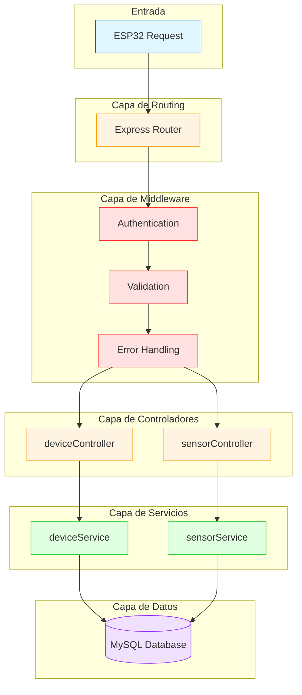

### Responsabilidades por Capa

| Capa | Responsabilidad | Archivos |
|------|-----------------|----------|
| **Router** | Mapea URLs a controladores | `routes/sensors.js`, `routes/devices.js` |
| **Middleware** | Autenticación, validación, manejo de errores | `middleware/auth.js`, `middleware/validate.js` |
| **Controller** | Maneja request/response, orquesta servicios | `controllers/sensorController.js` |
| **Service** | Lógica de negocio y acceso a datos | `services/sensorService.js` |
| **Database** | Queries SQL y conexión | `config/database.js` |

---

## Flujo Completo de una Petición

### Endpoint: POST /api/sensors/data

### Diagrama: Secuencia Completa de Validación

**Este diagrama muestra** el recorrido completo de una petición desde que el ESP32 envía datos hasta que recibe confirmación. Observa cómo cada middleware valida diferentes aspectos antes de procesar los datos.

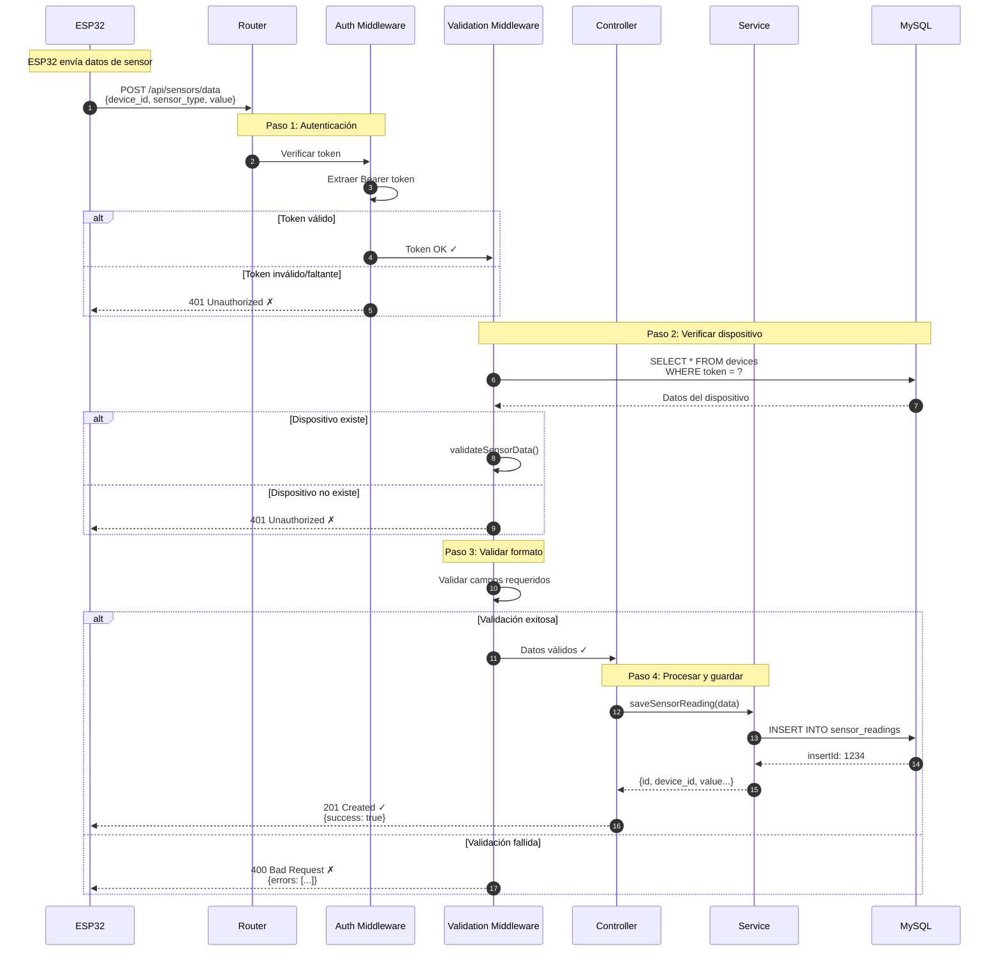

**Explicación de pasos**:
1. **Authentication**: Verifica que el token existe y tiene formato correcto
2. **Device Verification**: Confirma que el dispositivo está registrado
3. **Data Validation**: Valida que los campos cumplan los requisitos
4. **Processing**: Guarda los datos en la base de datos

---

## Capa de Middleware

### 1. Authentication Middleware

**Archivo**: `src/middleware/auth.js`

#### Función: `authenticateToken(req, res, next)`

**Propósito**: Verificar que la petición incluye un token válido.

**Proceso**:

1. Extrae el token del header `Authorization`
2. Verifica que el formato sea `Bearer TOKEN`
3. Valida que el token no esté vacío
4. Pasa el token a `req.token` para uso posterior
5. Llama a `next()` si todo es válido

### Diagrama: Flujo de Autenticación

**Este diagrama muestra** el proceso paso a paso de cómo se extrae y valida el token de autenticación.

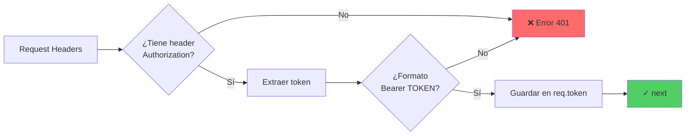

**Código simplificado**:

```javascript
export function authenticateToken(req, res, next) {
    const authHeader = req.headers['authorization'];
    const token = authHeader && authHeader.split(' ')[1]; // Bearer TOKEN
    
    if (!token) {
        return res.status(401).json({
            success: false,
            message: 'Access token required'
        });
    }
    
    req.token = token;
    next();
}
```

---

#### Función: `verifyDeviceToken(req, res, next)`

**Propósito**: Verificar que el token pertenece a un dispositivo registrado y activo.

### Diagrama: Verificación de Dispositivo

**Este diagrama muestra** cómo se verifica que el token corresponde a un dispositivo real en la base de datos.

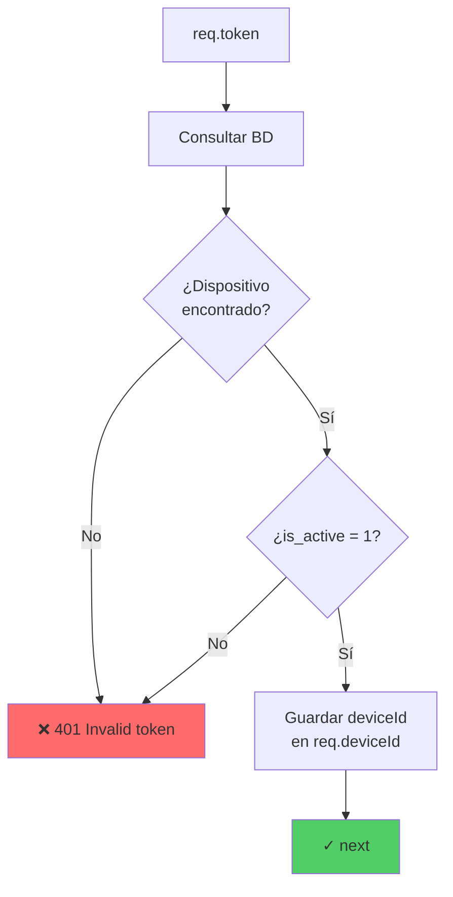

**Código simplificado**:

```javascript
export async function verifyDeviceToken(req, res, next) {
    try {
        const [devices] = await pool.query(
            'SELECT id, is_active FROM devices WHERE token = ? AND is_active = 1',
            [req.token]
        );
        
        if (devices.length === 0) {
            return res.status(401).json({
                success: false,
                message: 'Invalid device token'
            });
        }
        
        req.deviceId = devices[0].id;
        next();
    } catch (error) {
        res.status(500).json({
            success: false,
            message: 'Token verification failed'
        });
    }
}
```

---

### 2. Validation Middleware

**Archivo**: `src/middleware/validate.js`

### Diagrama: Validación de Datos del Sensor

**Este diagrama muestra** qué campos se validan y qué reglas se aplican a cada uno.

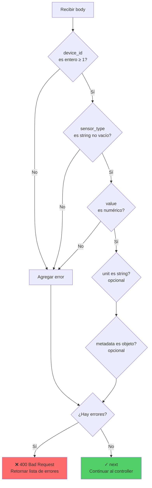

**Validaciones aplicadas**:

```javascript
export const validateSensorData = [
    // device_id debe ser un entero ≥ 1
    body('device_id').isInt({ min: 1 }).withMessage('Valid device_id required'),
    
    // sensor_type debe ser string no vacío
    body('sensor_type').isString().trim().notEmpty().withMessage('sensor_type required'),
    
    // value debe ser numérico (int o float)
    body('value').isFloat().withMessage('Numeric value required'),
    
    // unit es opcional, pero si existe debe ser string
    body('unit').optional().isString().trim(),
    
    // metadata es opcional, pero si existe debe ser objeto JSON
    body('metadata').optional().isObject(),
    
    // Middleware que revisa los resultados
    validate
];
```

---

## Capa de Controladores

**Archivo**: `src/controllers/sensorController.js`

### Función: `submitSensorData(req, res)`

### Diagrama: Flujo del Controlador

**Este diagrama muestra** cómo el controlador orquesta el guardado de datos sin manejar detalles de la base de datos.

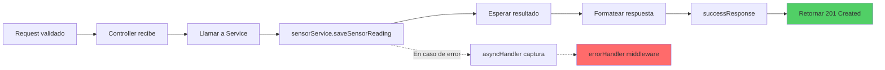

**Código**:

```javascript
export const submitSensorData = asyncHandler(async (req, res) => {
    // req.body ya está validado por el middleware
    const reading = await sensorService.saveSensorReading(req.body);
    
    successResponse(res, reading, 'Sensor data saved successfully', 201);
});
```

**El `asyncHandler` wrapper** captura automáticamente errores async:

```javascript
export const asyncHandler = (fn) => (req, res, next) => {
    Promise.resolve(fn(req, res, next)).catch(next);
};
```

---

## Capa de Servicios

**Archivo**: `src/services/sensorService.js`

### Función: `saveSensorReading(data)`

### Diagrama: Guardado en Base de Datos

**Este diagrama muestra** cómo se transforma el objeto JavaScript a una query SQL y se guarda en MySQL.

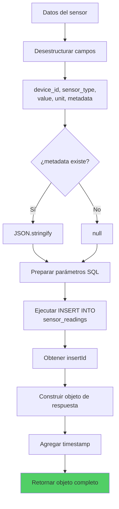

**Código simplificado**:

```javascript
export async function saveSensorReading(data) {
    const { device_id, sensor_type, value, unit, metadata } = data;
    
    // Preparar query SQL
    const query = `
        INSERT INTO sensor_readings 
        (device_id, sensor_type, value, unit, metadata)
        VALUES (?, ?, ?, ?, ?)
    `;
    
    // Convertir metadata a JSON string si existe
    const metadataJson = metadata ? JSON.stringify(metadata) : null;
    
    // Ejecutar INSERT
    const [result] = await pool.query(query, [
        device_id,
        sensor_type,
        value,
        unit || null,
        metadataJson
    ]);
    
    // Retornar el objeto creado
    return {
        id: result.insertId,
        device_id,
        sensor_type,
        value,
        unit,
        metadata,
        timestamp: new Date()
    };
}
```

---

## Ejemplos Paso a Paso

### Ejemplo 1: Petición Exitosa

#### ESP32 Envía

```http
POST /api/sensors/data HTTP/1.1
Host: 192.168.1.100:3000
Authorization: Bearer eyJhbGc...
Content-Type: application/json

{
  "device_id": 1,
  "sensor_type": "temperature",
  "value": 25.5,
  "unit": "°C",
  "metadata": {
    "battery_level": 85
  }
}
```

### Diagrama: Flujo Exitoso Completo

**Este diagrama muestra** el recorrido exitoso de los datos con todos los valores transformados en cada etapa.

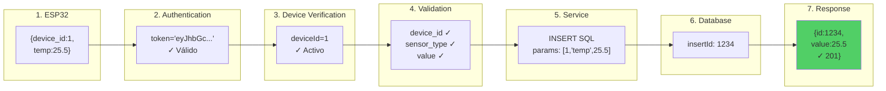

**Respuesta Final**:

```json
{
  "success": true,
  "message": "Sensor data saved successfully",
  "data": {
    "id": 1234,
    "device_id": 1,
    "sensor_type": "temperature",
    "value": 25.5,
    "unit": "°C",
    "metadata": {
      "battery_level": 85
    },
    "timestamp": "2025-12-08T16:30:00.000Z"
  }
}
```

---

### Ejemplo 2: Token Inválido

### Diagrama: Flujo con Error de Autenticación

**Este diagrama muestra** dónde se detiene el proceso cuando el token no es válido.

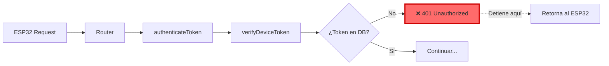

**Request**:
```http
Authorization: Bearer token_invalido123
```

**Response**:
```json
{
  "success": false,
  "message": "Invalid device token"
}
```

---

### Ejemplo 3: Validación Fallida

### Diagrama: Errores de Validación

**Este diagrama muestra** qué sucede cuando los datos tienen formato incorrecto.

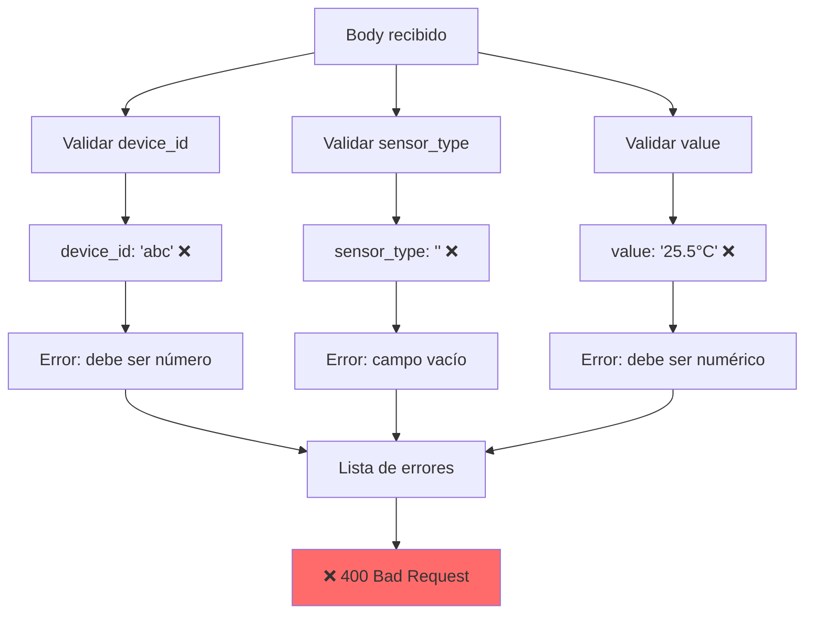

**Request Incorrecto**:
```json
{
  "device_id": "abc",     // ❌ String en vez de número
  "sensor_type": "",      // ❌ Vacío
  "value": "25.5°C"       // ❌ String en vez de número
}
```

**Response**:
```json
{
  "success": false,
  "message": "Validation failed",
  "errors": [
    {
      "msg": "Valid device_id required",
      "param": "device_id",
      "location": "body"
    },
    {
      "msg": "sensor_type required",
      "param": "sensor_type",
      "location": "body"
    },
    {
      "msg": "Numeric value required",
      "param": "value",
      "location": "body"
    }
  ]
}
```

---

## Resumen del Flujo de Datos

### Diagrama: Transformación de Datos en Cada Capa

**Este diagrama muestra** cómo los datos se transforman y enriquecen en cada capa del sistema.

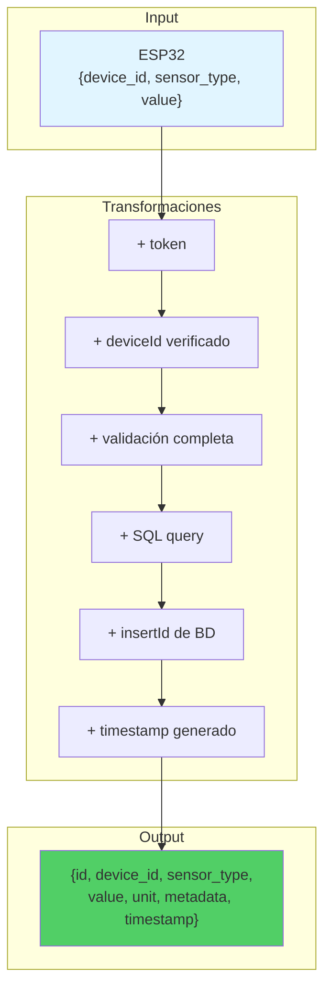

### Tabla de Transformación

| Etapa | Input | Output | Agregado |
|-------|-------|--------|----------|
| **ESP32** | Lectura sensor | JSON HTTP Request | Headers, Body |
| **Router** | HTTP Request | Llamada a middleware | - |
| **Auth MW** | Request + Headers | Request enriquecido | `req.token` |
| **Verify MW** | Token | Request enriquecido | `req.deviceId` |
| **Validation MW** | Body JSON | Body validado | Errores o ✓ |
| **Controller** | Body validado | Llamada a service | - |
| **Service** | Datos limpios | Query SQL | SQL params |
| **Database** | SQL Query | Insert result | `insertId` |
| **Service** | Insert result | Objeto completo | `id`, `timestamp` |
| **Controller** | Objeto completo | JSON Response | Formato estándar |

---

## Archivos Involucrados

| Archivo | Responsabilidad | Líneas Clave |
|---------|-----------------|--------------|
| `src/app.js` | Monta las rutas `/api/sensors` | 49-50 |
| `src/routes/sensors.js` | Define ruta POST con middlewares | 13-19 |
| `src/middleware/auth.js` | Autenticación y verificación | 10-25, 30-50 |
| `src/middleware/validate.js` | Reglas de validación | 23-30 |
| `src/controllers/sensorController.js` | Orquestación | 8-11 |
| `src/services/sensorService.js` | Lógica de negocio y DB | Todo |
| `src/config/database.js` | Conexión MySQL | Todo |

---

## Conclusión

El flujo de datos desde el ESP32 hasta la base de datos pasa por **6 capas principales**:

1. **Router**: Mapea URL a handlers
2. **Authentication**: Verifica token
3. **Authorization**: Valida dispositivo
4. **Validation**: Valida formato de datos
5. **Controller**: Orquesta la operación
6. **Service**: Ejecuta lógica de negocio y guarda en DB

Cada capa tiene una **responsabilidad específica** y trabaja con los datos transformados de la capa anterior, asegurando:

- ✅ Seguridad (autenticación/autorización)
- ✅ Integridad de datos (validación)
- ✅ Separación de responsabilidades (arquitectura en capas)
- ✅ Mantenibilidad (código organizado)
- ✅ Trazabilidad (logging en cada capa)
