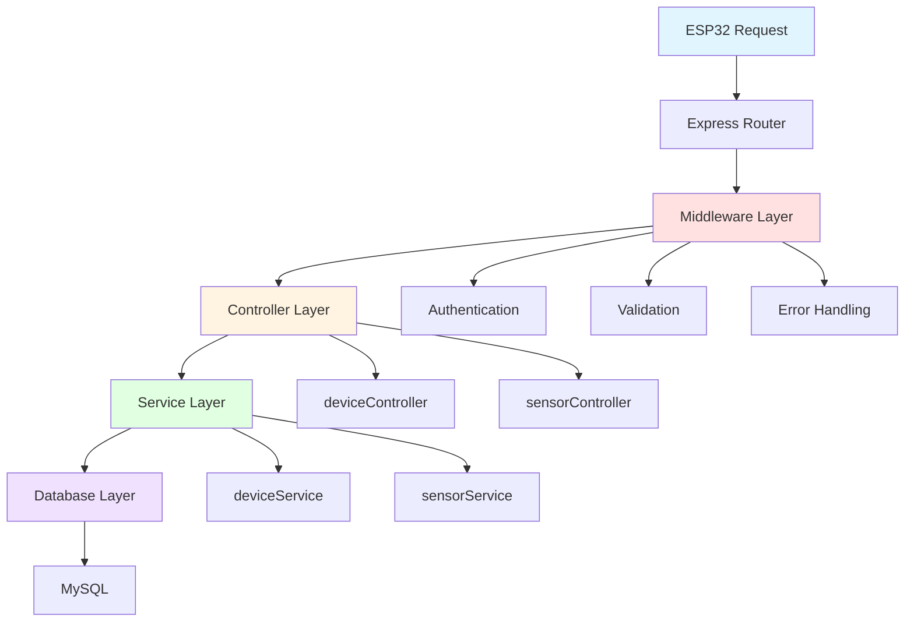
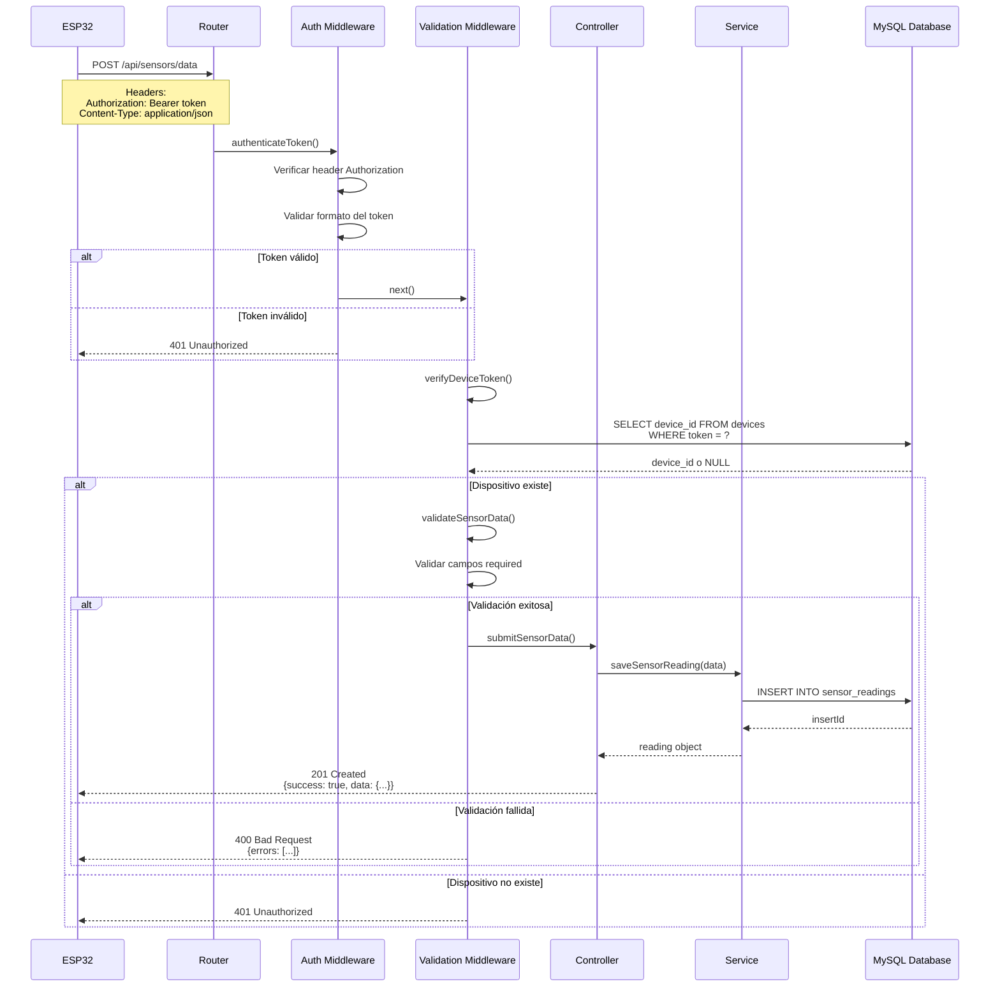
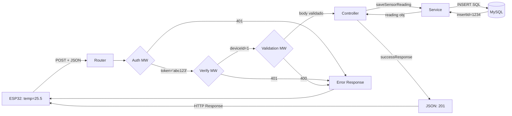

# Flujo de Datos: ESP32 → Backend

Esta documentación describe en detalle cómo el backend recibe, valida, procesa y almacena los datos enviados desde el ESP32.

## 📋 Tabla de Contenidos

- [Arquitectura de Capas](#arquitectura-de-capas)
- [Flujo Completo de una Petición](#flujo-completo-de-una-petición)
- [Capa de Middleware](#capa-de-middleware)
- [Capa de Controladores](#capa-de-controladores)
- [Capa de Servicios](#capa-de-servicios)
- [Ejemplos Paso a Paso](#ejemplos-paso-a-paso)

---

## Arquitectura de Capas

El backend sigue una arquitectura en capas que separa responsabilidades:



### Responsabilidades por Capa

| Capa | Responsabilidad | Archivos |
|------|-----------------|----------|
| **Router** | Mapea URLs a controladores | `routes/sensors.js`, `routes/devices.js` |
| **Middleware** | Autenticación, validación, manejo de errores | `middleware/auth.js`, `middleware/validate.js` |
| **Controller** | Maneja request/response, orquesta servicios | `controllers/sensorController.js` |
| **Service** | Lógica de negocio y acceso a datos | `services/sensorService.js` |
| **Database** | Queries SQL y conexión | `config/database.js` |

---

## Flujo Completo de una Petición

### Endpoint: POST /api/sensors/data

Cuando el ESP32 envía datos de sensores, la petición pasa por estas etapas:



---

## Capa de Middleware

### 1. Authentication Middleware

**Archivo**: `src/middleware/auth.js`

#### `authenticateToken(req, res, next)`

**Propósito**: Verificar que la petición incluye un token válido.

**Proceso**:

1. Extrae el token del header `Authorization`
2. Verifica que el formato sea `Bearer TOKEN`
3. Valida que el token no esté vacío
4. Pasa el token a `req.token` para uso posterior
5. Llama a `next()` si todo es válido

**Código simplificado**:

```javascript
export function authenticateToken(req, res, next) {
    const authHeader = req.headers['authorization'];
    const token = authHeader && authHeader.split(' ')[1]; // Bearer TOKEN
    
    if (!token) {
        return res.status(401).json({
            success: false,
            message: 'Access token required'
        });
    }
    
    req.token = token;
    next();
}
```

**Flujo**:

```
Request Headers
    ↓
Authorization: Bearer abc123xyz
    ↓
Split por espacio → ['Bearer', 'abc123xyz']
    ↓
token = 'abc123xyz'
    ↓
req.token = 'abc123xyz'
    ↓
next() → Siguiente middleware
```

---

#### `verifyDeviceToken(req, res, next)`

**Propósito**: Verificar que el token pertenece a un dispositivo registrado y activo.

**Proceso**:

1. Obtiene el token de `req.token` (seteado por `authenticateToken`)
2. Consulta la base de datos buscando el dispositivo con ese token
3. Verifica que el dispositivo esté activo (`is_active = 1`)
4. Guarda el `device_id` en `req.deviceId`
5. Llama a `next()` si todo es válido

**Código simplificado**:

```javascript
export async function verifyDeviceToken(req, res, next) {
    try {
        const [devices] = await pool.query(
            'SELECT id, is_active FROM devices WHERE token = ? AND is_active = 1',
            [req.token]
        );
        
        if (devices.length === 0) {
            return res.status(401).json({
                success: false,
                message: 'Invalid device token'
            });
        }
        
        req.deviceId = devices[0].id;
        next();
    } catch (error) {
        res.status(500).json({
            success: false,
            message: 'Token verification failed'
        });
    }
}
```

**Flujo**:

```
req.token = 'abc123xyz'
    ↓
SQL: SELECT id FROM devices WHERE token = 'abc123xyz' AND is_active = 1
    ↓
Resultado: [{id: 1}]
    ↓
req.deviceId = 1
    ↓
next() → Siguiente middleware
```

---

### 2. Validation Middleware

**Archivo**: `src/middleware/validate.js`

#### `validateSensorData` (Array de validadores)

**Propósito**: Validar que los datos del sensor tienen el formato correcto.

**Validaciones**:

```javascript
export const validateSensorData = [
    // device_id debe ser un entero ≥ 1
    body('device_id').isInt({ min: 1 }).withMessage('Valid device_id required'),
    
    // sensor_type debe ser string no vacío
    body('sensor_type').isString().trim().notEmpty().withMessage('sensor_type required'),
    
    // value debe ser numérico (int o float)
    body('value').isFloat().withMessage('Numeric value required'),
    
    // unit es opcional, pero si existe debe ser string
    body('unit').optional().isString().trim(),
    
    // metadata es opcional, pero si existe debe ser objeto JSON
    body('metadata').optional().isObject(),
    
    // Middleware que revisa los resultados
    validate
];
```

#### `validate(req, res, next)`

**Proceso**:

1. Recopila todos los errores de validación
2. Si hay errores, responde con 400 y la lista de errores
3. Si no hay errores, llama a `next()`

**Código**:

```javascript
export function validate(req, res, next) {
    const errors = validationResult(req);
    
    if (!errors.isEmpty()) {
        return res.status(400).json({
            success: false,
            message: 'Validation failed',
            errors: errors.array()
        });
    }
    
    next();
}
```

**Ejemplo de Respuesta de Error**:

```json
{
  "success": false,
  "message": "Validation failed",
  "errors": [
    {
      "msg": "Valid device_id required",
      "param": "device_id",
      "location": "body"
    },
    {
      "msg": "Numeric value required",
      "param": "value",
      "location": "body"
    }
  ]
}
```

---

### Flujo Completo del Middleware

```
POST /api/sensors/data
    |
    v
┌─────────────────────────┐
│ authenticateToken()     │ → Extrae y valida token
└──────────┬──────────────┘
           │ req.token = 'abc123'
           v
┌─────────────────────────┐
│ verifyDeviceToken()     │ → Verifica en DB
└──────────┬──────────────┘
           │ req.deviceId = 1
           v
┌─────────────────────────┐
│ validateSensorData      │ → Valida campos
│  - device_id            │
│  - sensor_type          │
│  - value                │
│  - unit (opcional)      │
│  - metadata (opcional)  │
└──────────┬──────────────┘
           │ req.body validado
           v
┌─────────────────────────┐
│ submitSensorData()      │ → Controller
└─────────────────────────┘
```

---

## Capa de Controladores

**Archivo**: `src/controllers/sensorController.js`

### `submitSensorData(req, res)`

**Propósito**: Recibir los datos validados y orquestar el guardado.

**Código**:

```javascript
export const submitSensorData = asyncHandler(async (req, res) => {
    // req.body ya está validado por el middleware
    const reading = await sensorService.saveSensorReading(req.body);
    
    successResponse(res, reading, 'Sensor data saved successfully', 201);
});
```

**Proceso**:

1. Recibe `req.body` ya validado
2. Llama al servicio `saveSensorReading()`
3. Espera la respuesta del servicio
4. Formatea la respuesta con `successResponse()`
5. Retorna HTTP 201 Created

**`asyncHandler` Wrapper**:

Este wrapper captura automáticamente errores async y los pasa al middleware de error:

```javascript
export const asyncHandler = (fn) => (req, res, next) => {
    Promise.resolve(fn(req, res, next)).catch(next);
};
```

---

## Capa de Servicios

**Archivo**: `src/services/sensorService.js`

### `saveSensorReading(data)`

**Propósito**: Guardar la lectura del sensor en la base de datos.

**Código simplificado**:

```javascript
export async function saveSensorReading(data) {
    const { device_id, sensor_type, value, unit, metadata } = data;
    
    // Preparar query SQL
    const query = `
        INSERT INTO sensor_readings 
        (device_id, sensor_type, value, unit, metadata)
        VALUES (?, ?, ?, ?, ?)
    `;
    
    // Convertir metadata a JSON string si existe
    const metadataJson = metadata ? JSON.stringify(metadata) : null;
    
    // Ejecutar INSERT
    const [result] = await pool.query(query, [
        device_id,
        sensor_type,
        value,
        unit || null,
        metadataJson
    ]);
    
    // Retornar el objeto creado
    return {
        id: result.insertId,
        device_id,
        sensor_type,
        value,
        unit,
        metadata,
        timestamp: new Date()
    };
}
```

**Proceso**:

1. Desestructura los datos del request
2. Prepara la query SQL con placeholders (`?`)
3. Convierte `metadata` a JSON string
4. Ejecuta la query con parámetros (previene SQL injection)
5. Obtiene el `insertId` del resultado
6. Retorna el objeto completo con el ID generado

**Query SQL Generado**:

```sql
INSERT INTO sensor_readings 
(device_id, sensor_type, value, unit, metadata)
VALUES (1, 'temperature', 25.5, '°C', '{"battery_level":85}')
```

---

## Ejemplos Paso a Paso

### Ejemplo 1: Petición Exitosa

#### 1. ESP32 Envía

```cpp
POST /api/sensors/data HTTP/1.1
Host: 192.168.1.100:3000
Authorization: Bearer eyJhbGc...
Content-Type: application/json

{
  "device_id": 1,
  "sensor_type": "temperature",
  "value": 25.5,
  "unit": "°C",
  "metadata": {
    "battery_level": 85
  }
}
```

#### 2. Router Recibe

```javascript
// routes/sensors.js
router.post(
    '/data',
    authenticateToken,      // Middleware 1
    verifyDeviceToken,      // Middleware 2
    validateSensorData,     // Middleware 3 (array)
    sensorController.submitSensorData  // Controller
);
```

#### 3. Middleware Ejecuta

**authenticateToken**:
```javascript
req.headers['authorization'] = 'Bearer eyJhbGc...'
token = 'eyJhbGc...'
req.token = 'eyJhbGc...'
✓ next()
```

**verifyDeviceToken**:
```sql
SELECT id FROM devices WHERE token = 'eyJhbGc...' AND is_active = 1
→ Resultado: [{id: 1}]
```
```javascript
req.deviceId = 1
✓ next()
```

**validateSensorData**:
```javascript
body('device_id').isInt({min: 1}) → ✓ (1 es válido)
body('sensor_type').notEmpty() → ✓ ('temperature' no está vacío)
body('value').isFloat() → ✓ (25.5 es numérico)
body('unit').optional() → ✓ ('°C' es string)
body('metadata').optional().isObject() → ✓ ({...} es objeto)
✓ next()
```

#### 4. Controller Ejecuta

```javascript
// sensorController.js
const reading = await sensorService.saveSensorReading(req.body);
```

#### 5. Service Guarda en DB

```sql
INSERT INTO sensor_readings 
(device_id, sensor_type, value, unit, metadata)
VALUES (1, 'temperature', 25.5, '°C', '{"battery_level":85}')

→ insertId: 1234
```

#### 6. Respuesta Formateada

```javascript
successResponse(res, reading, 'Sensor data saved successfully', 201);
```

```json
{
  "success": true,
  "message": "Sensor data saved successfully",
  "data": {
    "id": 1234,
    "device_id": 1,
    "sensor_type": "temperature",
    "value": 25.5,
    "unit": "°C",
    "metadata": {
      "battery_level": 85
    },
    "timestamp": "2025-12-08T16:30:00.000Z"
  }
}
```

---

### Ejemplo 2: Token Inválido

#### ESP32 Envía

```
Authorization: Bearer token_invalido123
```

#### Flujo

```
authenticateToken()
  ✓ Token existe

verifyDeviceToken()
  SQL: SELECT id FROM devices WHERE token = 'token_invalido123'
  Resultado: [] (vacío)
  ✗ DETENIDO
```

#### Respuesta

```json
{
  "success": false,
  "message": "Invalid device token"
}
```

HTTP Status: `401 Unauthorized`

---

### Ejemplo 3: Validación Fallida

#### ESP32 Envía

```json
{
  "device_id": "abc",  // ❌ String en vez de número
  "sensor_type": "",   // ❌ Vacío
  "value": "25.5°C"    // ❌ String en vez de número
}
```

#### Flujo

```
authenticateToken() ✓
verifyDeviceToken() ✓

validateSensorData:
  device_id: 'abc' no es entero ✗
  sensor_type: '' está vacío ✗
  value: '25.5°C' no es numérico ✗
  
✗ DETENIDO en validate()
```

#### Respuesta

```json
{
  "success": false,
  "message": "Validation failed",
  "errors": [
    {
      "msg": "Valid device_id required",
      "param": "device_id",
      "location": "body"
    },
    {
      "msg": "sensor_type required",
      "param": "sensor_type",
      "location": "body"
    },
    {
      "msg": "Numeric value required",
      "param": "value",
      "location": "body"
    }
  ]
}
```

HTTP Status: `400 Bad Request`

---

## Resumen del Flujo de Datos

### Tabla de Transformación de Datos

| Etapa | Input | Output | Agregado |
|-------|-------|--------|----------|
| **ESP32** | Lectura sensor | JSON HTTP Request | Headers, Body |
| **Router** | HTTP Request | Llamada a middleware | - |
| **Auth MW** | Request + Headers | Request enriquecido | `req.token` |
| **Verify MW** | Token | Request enriquecido | `req.deviceId` |
| **Validation MW** | Body JSON | Body validado | Errores o ✓ |
| **Controller** | Body validado | Llamada a service | - |
| **Service** | Datos limpios | Query SQL | SQL params |
| **Database** | SQL Query | Insert result | `insertId` |
| **Service** | Insert result | Objeto completo | `id`, `timestamp` |
| **Controller** | Objeto completo | JSON Response | Formato estándar |
| **ESP32** | HTTP Response | Log/ACK | - |

---

## Diagrama Completo con Datos



---

## Archivos Involucrados

| Archivo | Líneas Clave | Responsabilidad |
|---------|--------------|-----------------|
| `src/app.js` | 49-50 | Monta las rutas `/api/sensors` |
| `src/routes/sensors.js` | 13-19 | Define ruta POST con middlewares |
| `src/middleware/auth.js` | 10-25, 30-50 | Autenticación y verificación |
| `src/middleware/validate.js` | 23-30 | Reglas de validación |
| `src/controllers/sensorController.js` | 8-11 | Orquestación |
| `src/services/sensorService.js` | Todo | Lógica de negocio y DB |
| `src/config/database.js` | Todo | Conexión MySQL |

---

## Depuración y Logging

Para ver el flujo de datos en tiempo real, puedes agregar logs:

### En Middleware (auth.js)

```javascript
export function authenticateToken(req, res, next) {
    console.log('[AUTH] Headers:', req.headers);
    const authHeader = req.headers['authorization'];
    const token = authHeader && authHeader.split(' ')[1];
    console.log('[AUTH] Token extraído:', token);
    // ...
}
```

### En Controller (sensorController.js)

```javascript
export const submitSensorData = asyncHandler(async (req, res) => {
    console.log('[CONTROLLER] Body recibido:', req.body);
    console.log('[CONTROLLER] Device ID:', req.deviceId);
    const reading = await sensorService.saveSensorReading(req.body);
    console.log('[CONTROLLER] Reading guardado:', reading);
    // ...
});
```

### En Service (sensorService.js)

```javascript
export async function saveSensorReading(data) {
    console.log('[SERVICE] Guardando lectura:', data);
    const [result] = await pool.query(query, params);
    console.log('[SERVICE] Insert ID:', result.insertId);
    // ...
}
```

### Salida en Consola

```
[AUTH] Headers: { authorization: 'Bearer abc123', ... }
[AUTH] Token extraído: abc123
[VERIFY] Buscando dispositivo con token: abc123
[VERIFY] Dispositivo encontrado: ID=1
[VALIDATION] Validando datos...
[VALIDATION] ✓ Todos los campos válidos
[CONTROLLER] Body recibido: { device_id: 1, sensor_type: 'temperature', ... }
[CONTROLLER] Device ID: 1
[SERVICE] Guardando lectura: { device_id: 1, ... }
[SERVICE] Insert ID: 1234
[CONTROLLER] Reading guardado: { id: 1234, ... }
```

---

## Conclusión

El flujo de datos desde el ESP32 hasta la base de datos pasa por **6 capas principales**:

1. **Router**: Mapea URL a handlers
2. **Authentication**: Verifica token
3. **Authorization**: Valida dispositivo
4. **Validation**: Valida formato de datos
5. **Controller**: Orquesta la operación
6. **Service**: Ejecuta lógica de negocio y guarda en DB

Cada capa tiene una **responsabilidad específica** y trabaja con los datos transformados de la capa anterior, asegurando:

- ✅ Seguridad (autenticación/autorización)
- ✅ Integridad de datos (validación)
- ✅ Separación de responsabilidades (arquitectura en capas)
- ✅ Mantenibilidad (código organizado)
- ✅ Trazabilidad (logging en cada capa)
